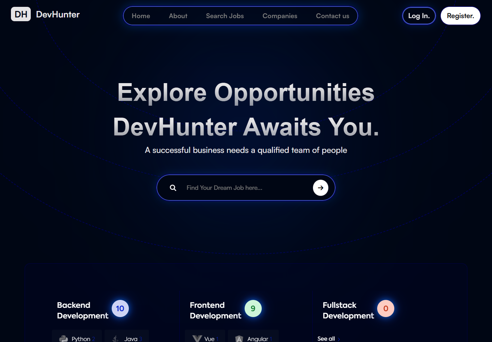
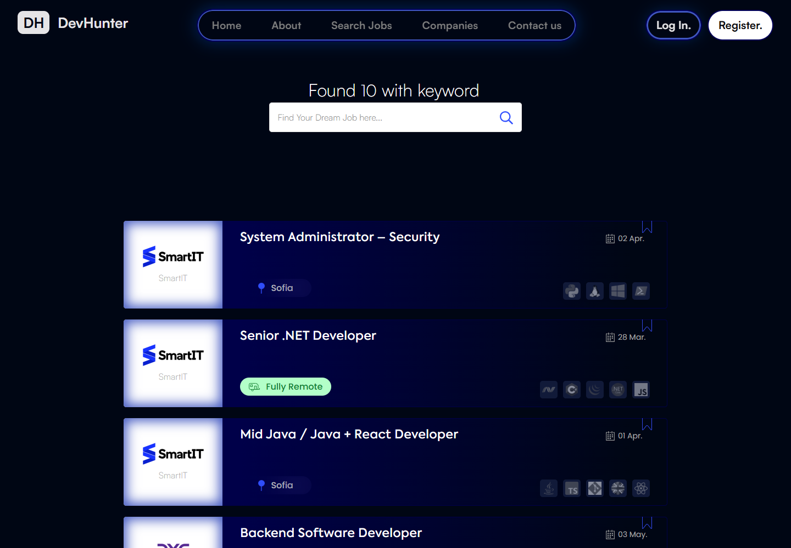
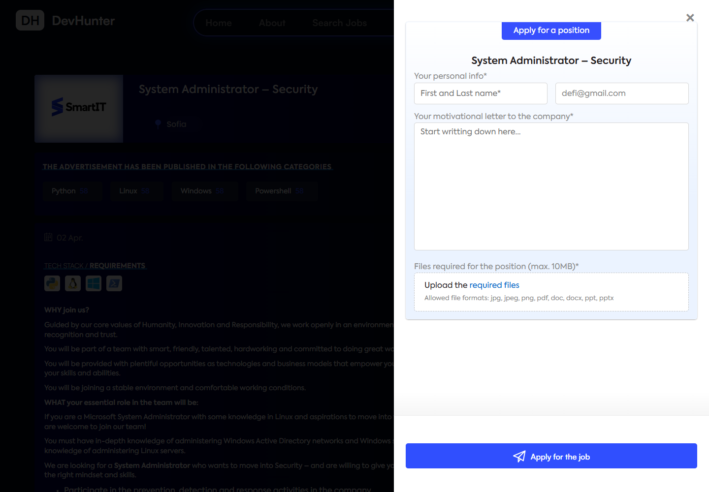
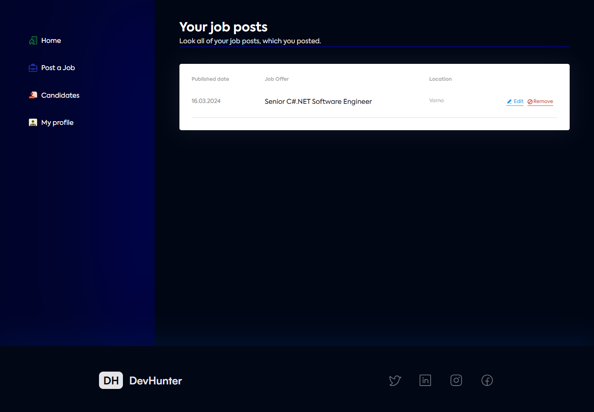
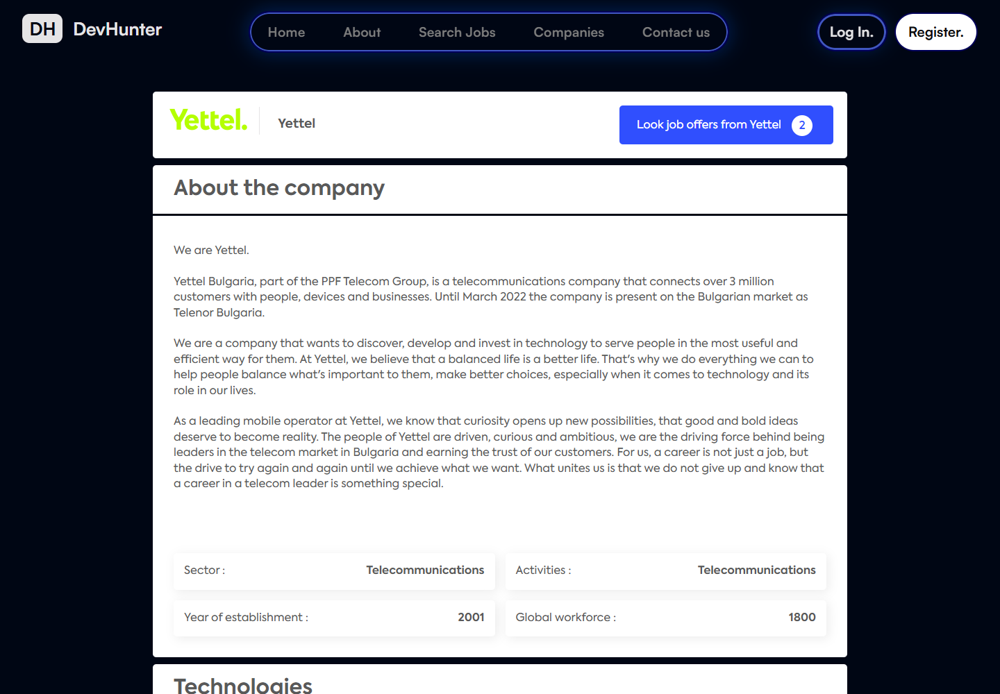

# DevHunter

DevHunter is a role-based IT recruitment platform built with ASP.NET Core MVC. Candidates can discover and apply for jobs, companies can manage offers and applicants, and administrators can maintain platform content.

[Live Demo Showcase](https://devhuntershowcase.vercel.app/)

> The showcase is a static React site. The full ASP.NET MVC application runs locally.



## Quick Highlights

| Area | Details |
| --- | --- |
| Application | ASP.NET Core MVC on .NET 8 |
| Data | Entity Framework Core and SQL Server |
| Authentication | ASP.NET Core Identity with candidate, company, and admin roles |
| Testing | 177 automated tests |
| Delivery | GitHub Actions CI |
| Configuration | Local secrets managed with `dotnet user-secrets` |
| Security | Role checks and service-level ownership enforcement |

## Screenshots

| Job discovery | Job details |
| --- | --- |
|  |  |

| Candidate application | Company dashboard |
| --- | --- |
|  |  |

| Company details | Admin panel |
| --- | --- |
|  |  |

## Features by Role

| Candidate | Company | Admin |
| --- | --- | --- |
| Search and filter job offers | Create and manage owned job offers | Manage users and companies |
| Save jobs for later | Review job applications | Manage technologies |
| Apply with documents | Approve or reject applicants | Manage development categories |
| Track submitted applications | Maintain company profile | Access role-protected admin tools |

Additional features include server-side pagination, HTML-sanitized job descriptions, Cloudinary uploads, and SMTP contact messages.

## Tech Stack

| Category | Technologies |
| --- | --- |
| Backend | C#, .NET 8, ASP.NET Core MVC |
| Data | Entity Framework Core, SQL Server |
| Identity and security | ASP.NET Core Identity, role authorization, HTML sanitization |
| Integrations | Cloudinary, MailKit |
| Testing | NUnit, Moq, in-memory test data |
| Delivery | GitHub Actions |
| Showcase | React, Vite, TypeScript |

## Local Setup

### Requirements

- .NET 8 SDK
- SQL Server or SQL Server Express
- Optional Cloudinary account for uploads
- Optional SMTP account for contact messages

### Configure and Run

```powershell
git clone https://github.com/hristianivanov/ITJob-Finder-ASP.NET-MVC.git
cd ITJob-Finder-ASP.NET-MVC/src

dotnet restore DevHunter.sln

cd DevHunter.Web
dotnet user-secrets set "ConnectionStrings:DefaultConnection" "your-sql-server-connection-string"
dotnet user-secrets set "AccountSettings:CloudName" "your-cloud-name"
dotnet user-secrets set "AccountSettings:ApiKey" "your-cloudinary-api-key"
dotnet user-secrets set "AccountSettings:ApiSecret" "your-cloudinary-api-secret"
dotnet user-secrets set "EmailConfiguration:To" "recipient@example.com"
dotnet user-secrets set "EmailConfiguration:SmtpServer" "smtp.example.com"
dotnet user-secrets set "EmailConfiguration:Port" "465"
dotnet user-secrets set "EmailConfiguration:UserName" "smtp-user@example.com"
dotnet user-secrets set "EmailConfiguration:Password" "your-smtp-password"

dotnet run
```

Configuration keys are documented in [`src/DevHunter.Web/appsettings.example.json`](src/DevHunter.Web/appsettings.example.json). Do not commit real credentials.

Database migrations and seeded demo data are applied during startup.

### Build and Test

```powershell
cd src
dotnet build DevHunter.sln
dotnet test DevHunter.Services.Tests/DevHunter.Services.Tests.csproj
```

### Static Showcase

```powershell
cd showcase
corepack pnpm install
corepack pnpm build
corepack pnpm dev
```

## Demo Accounts

These accounts are created only for the seeded local demo environment.

| Role | Email | Password |
| --- | --- | --- |
| Candidate | `defi@gmail.com` | `123456` |
| Company | `smartit@gmail.com` | `company123` |
| Administrator | `admin@gmail.com` | `Admin12345678!` |

Do not use these credentials in a production environment.
