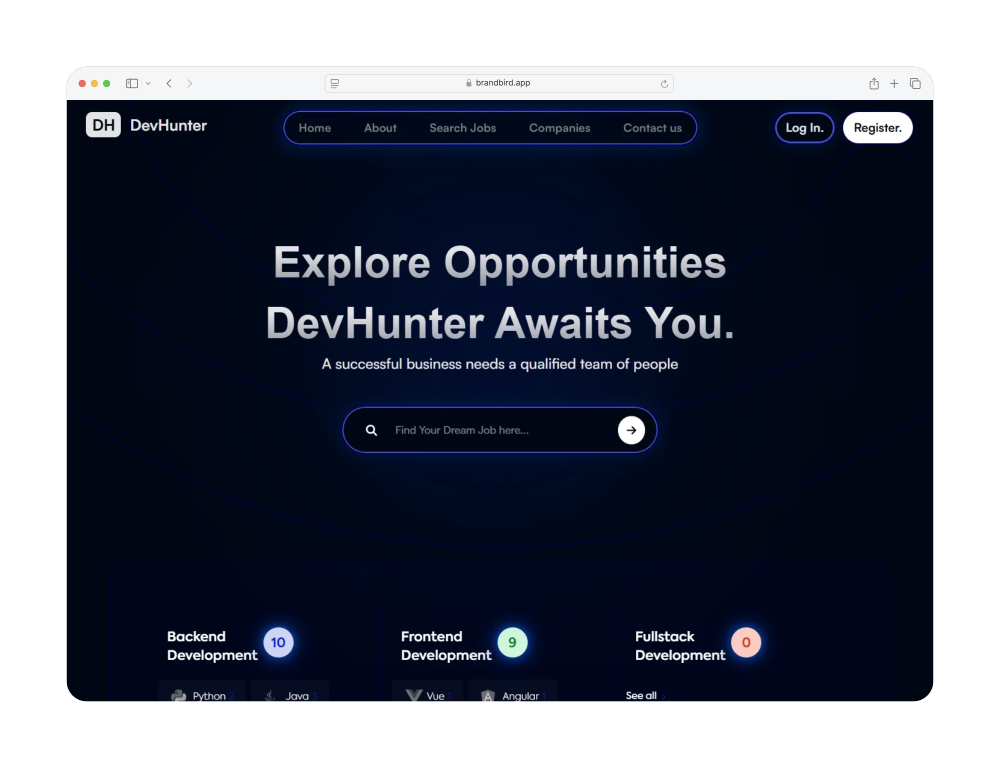
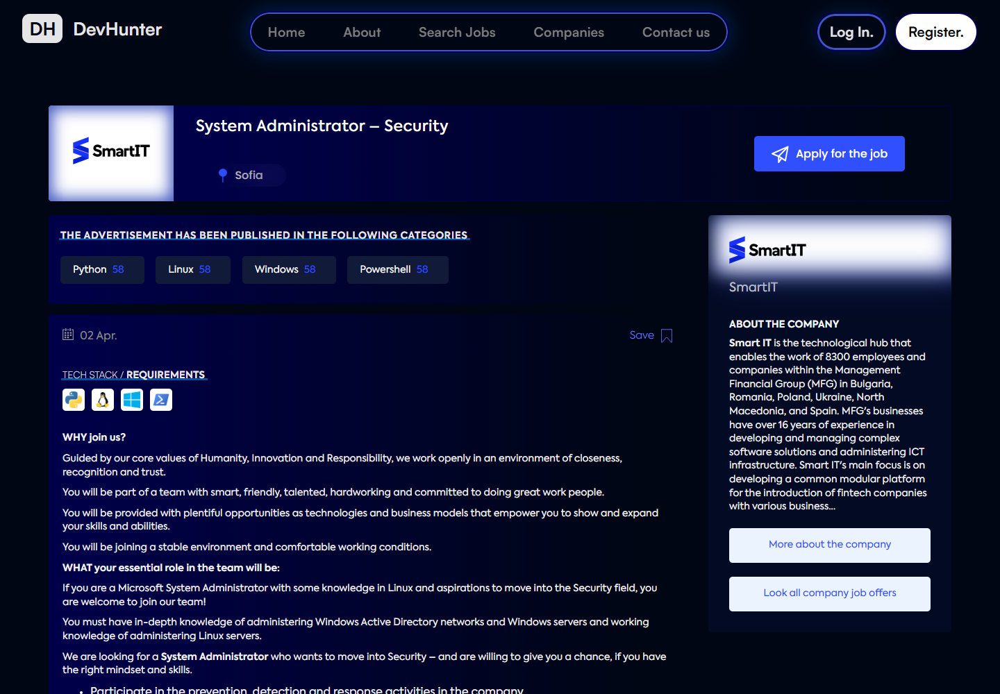
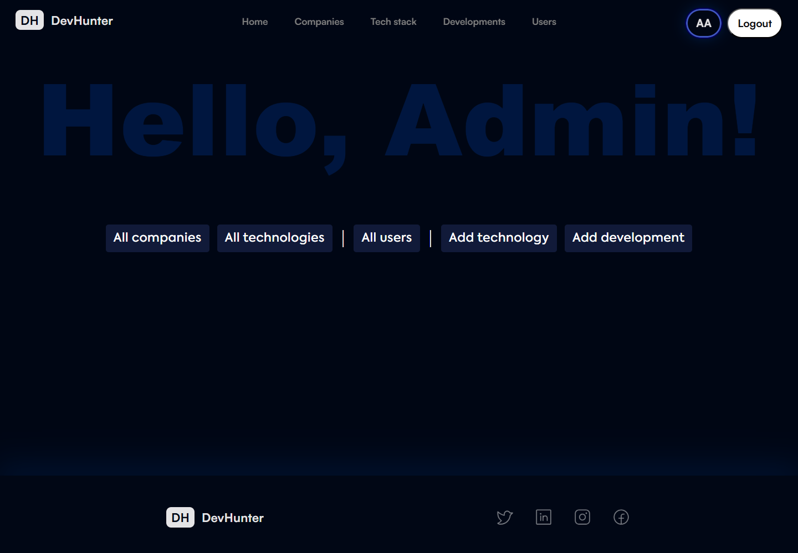

<div align="center">

[](https://github.com/hristianivanov/ITJob-Finder-ASP.NET-MVC/actions/workflows/dotnet.yml)


</div>

</br>


<div align="center">

# DevHunter **IT Recruitment Platform**

Role-based **IT Recruitment Platform** built with **ASP.NET Core MVC**

**candidates** can discover and apply for jobs,

**companies** can manage offers and applicants,

and **administrators** can maintain platform content.

</div>

## Landing page

[Live Demo Showcase](https://devhuntershowcase.vercel.app/)

> The showcase is a static React site. The full ASP.NET MVC application runs locally.



## Quick Highlights

| Area           | Details                                                        |
| -------------- | -------------------------------------------------------------- |
| Application    | ASP.NET Core MVC on .NET 8                                     |
| Architecture   | Areas-based MVC (Admin, Company, Manage)                       |
| Data           | Entity Framework Core and SQL Server                           |
| Authentication | ASP.NET Core Identity with candidate, company, and admin roles |
| Storage        | Cloudinary for images and document uploads                     |
| Testing        | NUnit + FluentAssertions                                       |
| Delivery       | GitHub Actions CI (build + test)                               |
| Configuration  | Local secrets managed with `dotnet user-secrets`               |
| Security       | Role checks and service-level ownership enforcement            |

## Screenshots

| Job discovery                                        | Job details                                                |
| ---------------------------------------------------- | ---------------------------------------------------------- |
|  |  |

| Candidate application                                                    | Company dashboard                                                      |
| ------------------------------------------------------------------------ | ---------------------------------------------------------------------- |
|  |  |

| Company details                                                    | Admin panel                                                |
| ------------------------------------------------------------------ | ---------------------------------------------------------- |
|  |  |

## Features by Role

| Candidate 👤                  | Company 🏢                          | Admin 🛡️                           |
| ---------------------------- | ---------------------------------- | --------------------------------- |
| Search and filter job offers | Create and manage owned job offers | Manage users and companies        |
| Save jobs for later          | Review job applications            | Manage technologies               |
| Apply with documents         | Approve or reject applicants       | Manage development tracks         |
| Track submitted applications | Maintain company profile           | Access role-protected admin tools |

## Tech Stack

| Category     | Technologies                                             |
| ------------ | -------------------------------------------------------- |
| Backend      | C#, .NET 8, ASP.NET Core MVC                             |
| Frontend     | Razor Views, Bootstrap, vanilla JS                       |
| Data         | Entity Framework Core, SQL Server                        |
| Security     | ASP.NET Core Identity, role authorization, HtmlSanitizer |
| Integrations | Cloudinary, MailKit                                      |
| Testing      | NUnit, Moq, FluentAssertions, in-memory EF Core          |
| Delivery     | GitHub Actions CI (build + test)                         |


## Local Setup
### Configure and Run

Configuration keys are documented in [`src/DevHunter.Web/appsettings.example.json`](src/DevHunter.Web/appsettings.example.json).

Database migrations and seeded demo data are applied during startup.

> [!IMPORTANT]
> - [x] __*.NET 8 SDK*__   
> - [x]  __*SQL Server / SQL Server Express*__

> __OPTIONAL :__ _Cloudinary account for uploads, 
> SMTP account for contact messages_

</br>

### Steps to run

**1. Clone the repository**

```bash
git clone https://github.com/hristianivanov/ITJob-Finder-ASP.NET-MVC.git
```
**2. Set your connection string**

```bash
dotnet user-secrets set "ConnectionStrings:DefaultConnection" "Server=YOUR_SERVER;Database=DevHunter;Trusted_Connection=True;"
```
> Replace `YOUR_SERVER` with your SQL Server instance name (e.g. `localhost` or `.\SQLEXPRESS`)

**3. Run the app — migrations and seed data apply automatically on first startup**

```bash
dotnet run --project src/DevHunter.Web
```

<details> 
<summary><strong>Optional — Cloudinary</strong> <i>(image & document uploads)</i></summary>

Create a free account at cloudinary.com, then set your credentials:

```bash
dotnet user-secrets set "Cloudinary:CloudName" "your_cloud_name"
dotnet user-secrets set "Cloudinary:ApiKey" "your_api_key"
dotnet user-secrets set "Cloudinary:ApiSecret" "your_api_secret"
```

</details>

<details> 
<summary><strong>Optional — SMTP </strong> <i>(contact messages)</i></summary>

```bash
dotnet user-secrets set "Email:Host" "smtp.your-provider.com"
dotnet user-secrets set "Email:Port" "587"
dotnet user-secrets set "Email:Username" "your@email.com"
dotnet user-secrets set "Email:Password" "your_password"
```
</details>

</br>

### Demo Accounts

These accounts are created only for the seeded local demo environment.

| Role          | Email               | Password         |
| ------------- | ------------------- | ---------------- |
| Candidate     | `defi@gmail.com`    | `123456`         |
| Company       | `smartit@gmail.com` | `company123`     |
| Administrator | `admin@gmail.com`   | `Admin12345678!` |

> [!CAUTION]
> Do not use these credentials in a production environment.

## Give a Star ⭐

If you find this project useful, please consider giving it a star! It helps to show appreciation for the effort put into this project.
