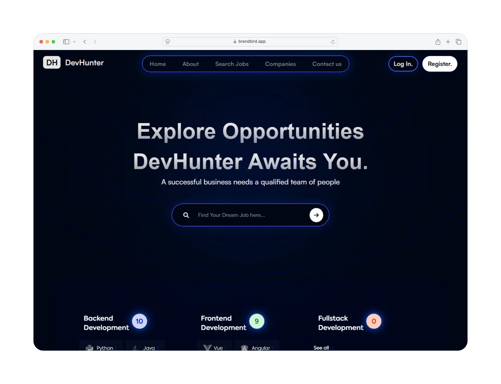
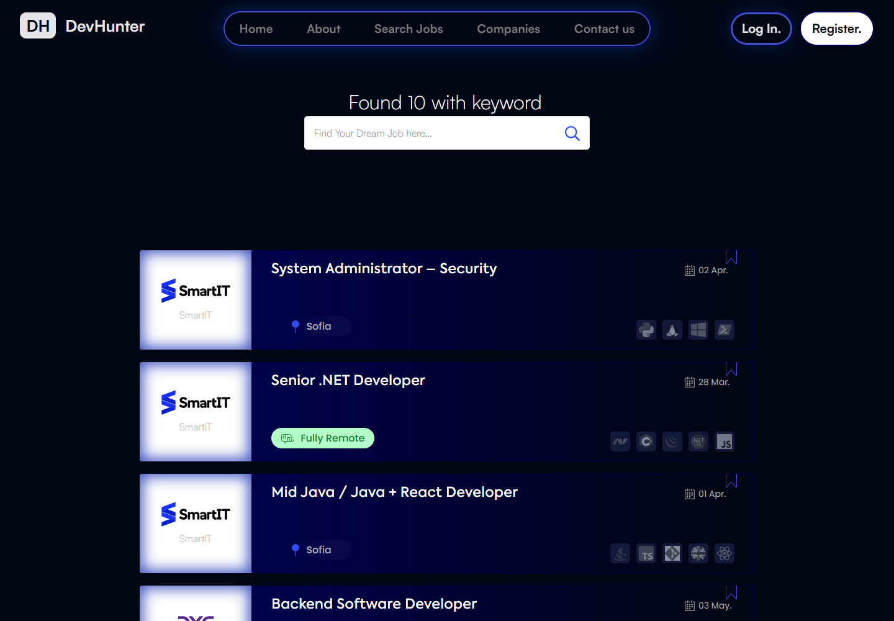
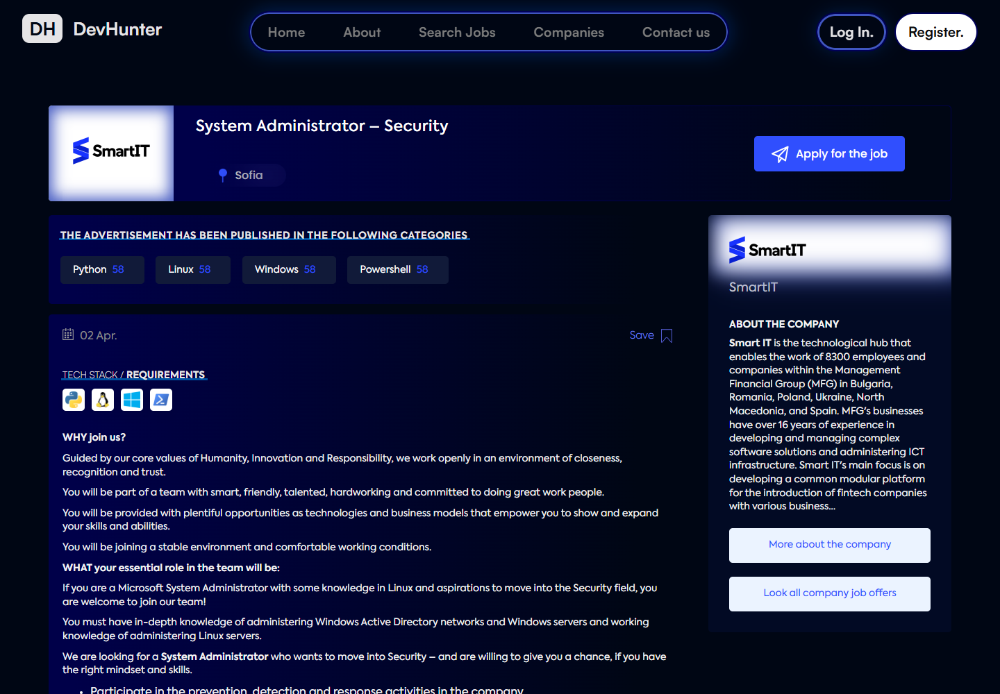
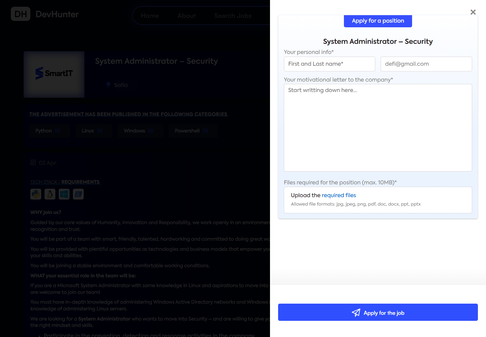
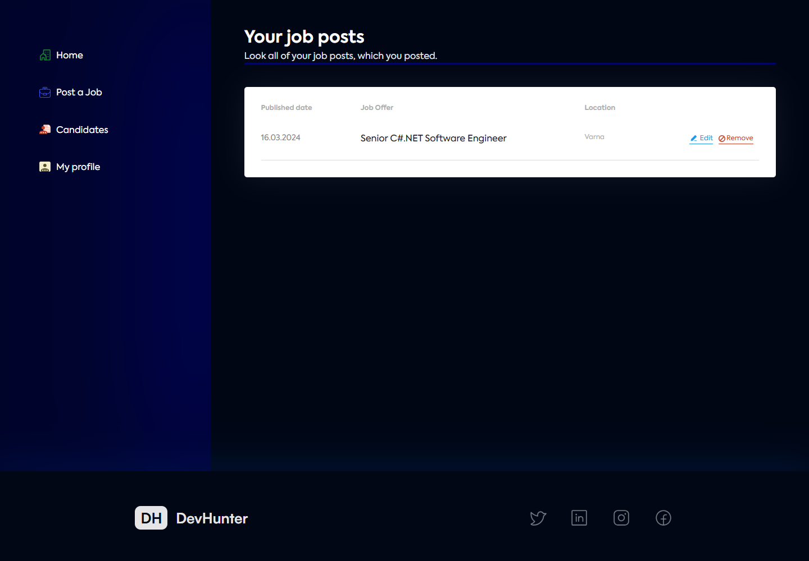
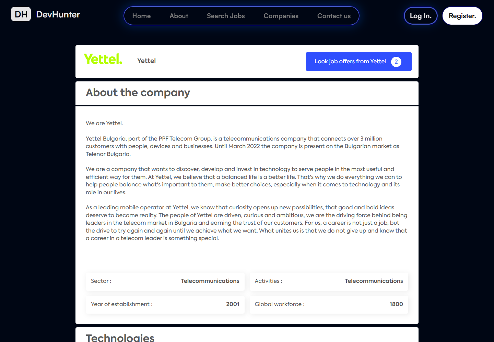
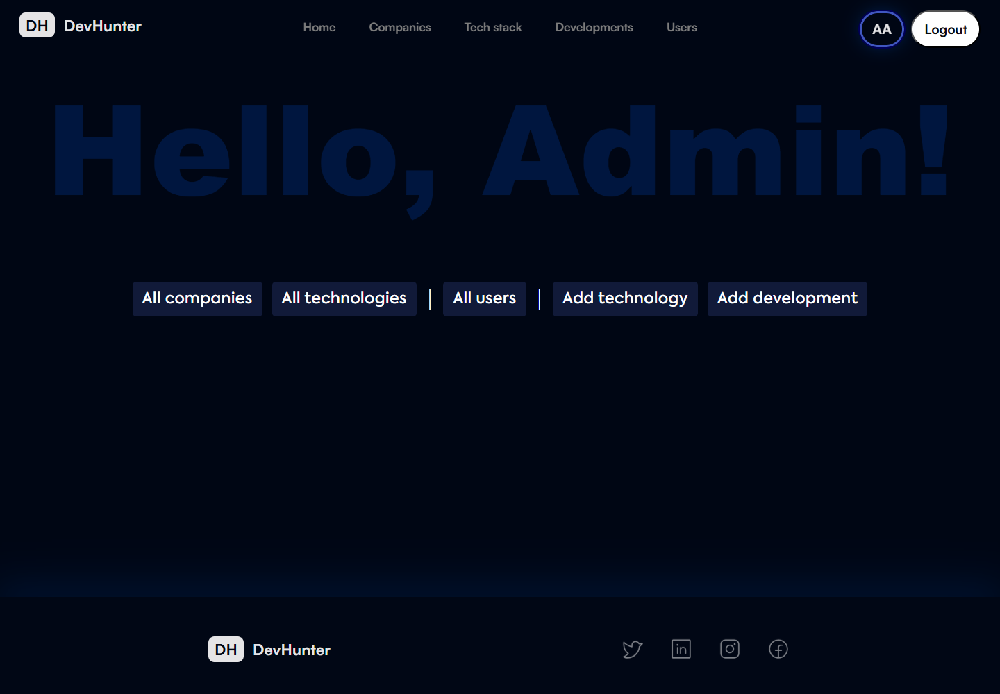

<div align="center">

[![Build and test][ci-img]][ci-url]
[![Stars][stars-img]][stars-url]
[![Forks][forks-img]][forks-url]

</div>

</br>

<picture>
  <source media="(prefers-color-scheme: dark)" srcset="docs/devhunter-logo-dark.svg">
  <source media="(prefers-color-scheme: light)" srcset="docs/devhunter-logo.svg">
  
</picture>

<div align="center">

# DevHunter **IT Recruitment Platform**

Role-based **IT Recruitment Platform** built with **ASP.NET Core MVC**

**candidates** can discover and apply for jobs,

**companies** can manage offers and applicants,

and **administrators** can maintain platform content.

</div>

## Landing page

[Live Demo Showcase](https://youtu.be/9f-O99ygbmk)

> The showcase is a video demonstration. The full ASP.NET MVC application runs locally.



## Quick Highlights

| Area           | Details                                                        |
| -------------- | -------------------------------------------------------------- |
| Application    | ASP.NET Core MVC on .NET 10                                    |
| Architecture   | Areas-based MVC (Admin, Company, Manage)                       |
| Data           | Entity Framework Core and SQL Server                           |
| Authentication | ASP.NET Core Identity with candidate, company, and admin roles |
| Storage        | Cloudinary for images and document uploads                     |
| Testing        | NUnit + FluentAssertions                                       |
| Delivery       | GitHub Actions CI (build + test)                               |
| Configuration  | Local secrets managed with `dotnet user-secrets`               |
| Security       | Role checks and service-level ownership enforcement            |

## Screenshots

| Job discovery                                        | Job details                                                |
| ---------------------------------------------------- | ---------------------------------------------------------- |
|  |  |

| Candidate application                                                    | Company dashboard                                                      |
| ------------------------------------------------------------------------ | ---------------------------------------------------------------------- |
|  |  |

| Company details                                                    | Admin panel                                                |
| ------------------------------------------------------------------ | ---------------------------------------------------------- |
|  |  |

## Features by Role

| Candidate 👤                  | Company 🏢                          | Admin 🛡️                           |
| ---------------------------- | ---------------------------------- | --------------------------------- |
| Search and filter job offers | Create and manage owned job offers | Manage users and companies        |
| Save jobs for later          | Review job applications            | Manage technologies               |
| Apply with documents         | Approve or reject applicants       | Manage development tracks         |
| Track submitted applications | Maintain company profile           | Access role-protected admin tools |

## Tech Stack

| Area         | Technologies                                                                                                                              |
| ------------ | ----------------------------------------------------------------------------------------------------------------------------------------- |
| Backend      | [![C#][badge-csharp]][badge-csharp] [![.NET 10][badge-dotnet]][badge-dotnet] [![ASP.NET Core MVC][badge-aspnet]][badge-aspnet]            |
| Frontend     | [![Razor Views][badge-razor]][badge-razor] [![Bootstrap][badge-bootstrap]][badge-bootstrap] [![JavaScript][badge-js]][badge-js]           |
| Data         | [![EF Core][badge-efcore]][badge-efcore] [![SQL Server][badge-sqlserver]][badge-sqlserver]                                                |
| Security     | [![ASP.NET Identity][badge-identity]][badge-identity] [![HtmlSanitizer][badge-htmlsanitizer]][badge-htmlsanitizer]                        |
| Integrations | [![Cloudinary][badge-cloudinary]][badge-cloudinary] [![MailKit][badge-mailkit]][badge-mailkit]                                            |
| Testing      | [![NUnit][badge-nunit]][badge-nunit] [![Moq][badge-moq]][badge-moq] [![FluentAssertions][badge-fluentassertions]][badge-fluentassertions] |
| Delivery     | [![GitHub Actions][badge-ghactions]][badge-ghactions]                                                                                     |


## Local Setup
### Configure and Run

> [!IMPORTANT]
> - [x] __*.NET 10 SDK*__   
> - [x]  __*SQL Server / SQL Server Express*__

> __OPTIONAL :__ _Cloudinary account for uploads, 
> SMTP account for contact messages_

</br>

### Steps to run

**1. Clone the repository**

```bash
git clone https://github.com/hristianivanov/ITJob-Finder-ASP.NET-MVC.git
```
**2. Set your connection string**

```bash
dotnet user-secrets set "ConnectionStrings:DefaultConnection" "Server=YOUR_SERVER;Database=DevHunter;Trusted_Connection=True;"
```
> Replace `YOUR_SERVER` with your SQL Server instance name (e.g. `localhost` or `.\SQLEXPRESS`)

**3. Run the app — migrations and seed data apply automatically on first startup**

```bash
dotnet run --project src/DevHunter.Web
```

<details> 
<summary><strong>Optional — Cloudinary</strong> <i>(image & document uploads)</i></summary>

Create a free account at cloudinary.com, then set your credentials:

```bash
dotnet user-secrets set "Cloudinary:CloudName" "your_cloud_name"
dotnet user-secrets set "Cloudinary:ApiKey" "your_api_key"
dotnet user-secrets set "Cloudinary:ApiSecret" "your_api_secret"
```

</details>

<details> 
<summary><strong>Optional — SMTP </strong> <i>(contact messages)</i></summary>

```bash
dotnet user-secrets set "Email:Host" "smtp.your-provider.com"
dotnet user-secrets set "Email:Port" "587"
dotnet user-secrets set "Email:Username" "your@email.com"
dotnet user-secrets set "Email:Password" "your_password"
```
</details>

</br>

### Demo Accounts
###### Database migrations and seeded demo data are applied during startup.

</br>

These accounts are created only for the seeded local demo environment.

| Role          | Email               | Password         |
| ------------- | ------------------- | ---------------- |
| Candidate     | `defi@gmail.com`    | `123456`         |
| Company       | `smartit@gmail.com` | `company123`     |
| Administrator | `admin@gmail.com`   | `Admin12345678!` |

> [!CAUTION]
> Do not use these credentials in a production environment.

## Give a Star ⭐

If you find this project useful, please consider giving it a star! It helps to show appreciation for the effort put into this project.


<!---------------------------------- LINKS ------------------------------------->

[stars-img]: https://img.shields.io/github/stars/hristianivanov/ITJob-Finder-ASP.NET-MVC
[stars-url]: https://github.com/hristianivanov/ITJob-Finder-ASP.NET-MVC/stargazers

[ci-img]:    https://github.com/hristianivanov/ITJob-Finder-ASP.NET-MVC/actions/workflows/dotnet.yml/badge.svg
[ci-url]:    https://github.com/hristianivanov/ITJob-Finder-ASP.NET-MVC/actions/workflows/dotnet.yml

[forks-img]: https://img.shields.io/github/forks/hristianivanov/ITJob-Finder-ASP.NET-MVC
[forks-url]: https://github.com/hristianivanov/ITJob-Finder-ASP.NET-MVC/network/members

<!--------------------------------- BADGES ------------------------------------>

[badge-csharp]:           https://img.shields.io/badge/C%23-239120?style=for-the-badge&logo=csharp&logoColor=white
[badge-dotnet]:           https://img.shields.io/badge/.NET_10-512BD4?style=for-the-badge&logo=dotnet&logoColor=white
[badge-aspnet]:           https://img.shields.io/badge/ASP.NET_Core_MVC-0078D4?style=for-the-badge&logo=dotnet&logoColor=white
[badge-razor]:            https://img.shields.io/badge/Razor_Views-68217A?style=for-the-badge&logo=dotnet&logoColor=white
[badge-bootstrap]:        https://img.shields.io/badge/Bootstrap-7952B3?style=for-the-badge&logo=bootstrap&logoColor=white
[badge-js]:               https://img.shields.io/badge/JavaScript-F7DF1E?style=for-the-badge&logo=javascript&logoColor=black
[badge-efcore]:           https://img.shields.io/badge/EF_Core-512BD4?style=for-the-badge&logo=dotnet&logoColor=white
[badge-sqlserver]:        https://img.shields.io/badge/SQL_Server-CC2927?style=for-the-badge&logo=microsoftsqlserver&logoColor=white
[badge-identity]:         https://img.shields.io/badge/ASP.NET_Identity-0078D4?style=for-the-badge&logo=microsoft&logoColor=white
[badge-htmlsanitizer]:    https://img.shields.io/badge/HtmlSanitizer-E34F26?style=for-the-badge&logo=html5&logoColor=white
[badge-cloudinary]:       https://img.shields.io/badge/Cloudinary-3448C5?style=for-the-badge&logo=cloudinary&logoColor=white
[badge-mailkit]:          https://img.shields.io/badge/MailKit-EA4335?style=for-the-badge&logo=gmail&logoColor=white
[badge-nunit]:            https://img.shields.io/badge/NUnit-25A162?style=for-the-badge&logo=dotnet&logoColor=white
[badge-moq]:              https://img.shields.io/badge/Moq-7B2FBE?style=for-the-badge&logo=dotnet&logoColor=white
[badge-fluentassertions]: https://img.shields.io/badge/FluentAssertions-00897B?style=for-the-badge&logo=checkmarx&logoColor=white
[badge-ghactions]:        https://img.shields.io/badge/GitHub_Actions-2088FF?style=for-the-badge&logo=githubactions&logoColor=white